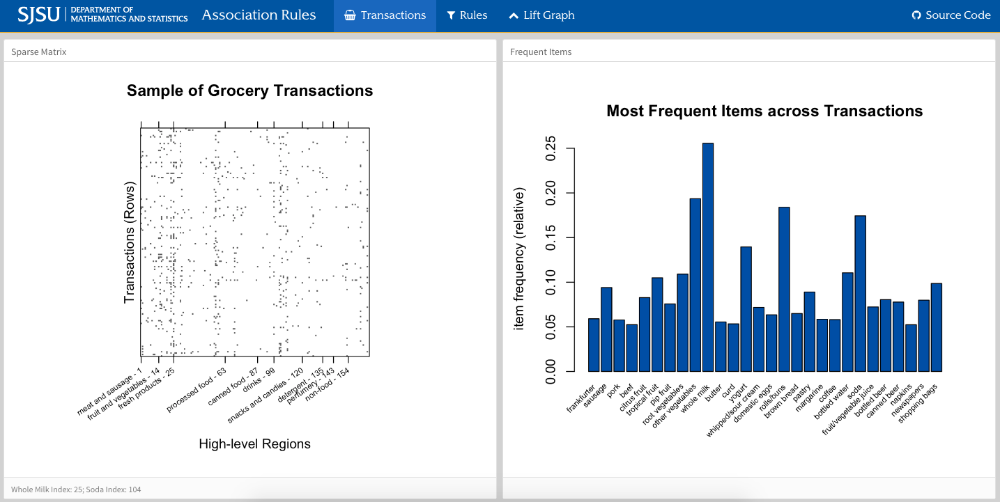

# Association Rules

Code for MATH 269 association rules instructional presentation

Grocery example dashboard shown during presentation (image links to html page).
[](https://ryan-quigley.github.io/association-rules/dash_ar.html)


### Getting Started

```R
install.packages(c("arules", "arulesViz"))
```

### References

[Elements of Statistical Learning, Chapter 14, Section 14.2](https://statweb.stanford.edu/~tibs/ElemStatLearn/)  
[Introduction to arules – A computational
environment for mining association rules and
frequent item sets](https://cran.r-project.org/web/packages/arules/vignettes/arules.pdf)  
[Visualizing Association Rules: 
Introduction to the R-extension Package arulesViz](https://cran.r-project.org/web/packages/arulesViz/vignettes/arulesViz.pdf)
